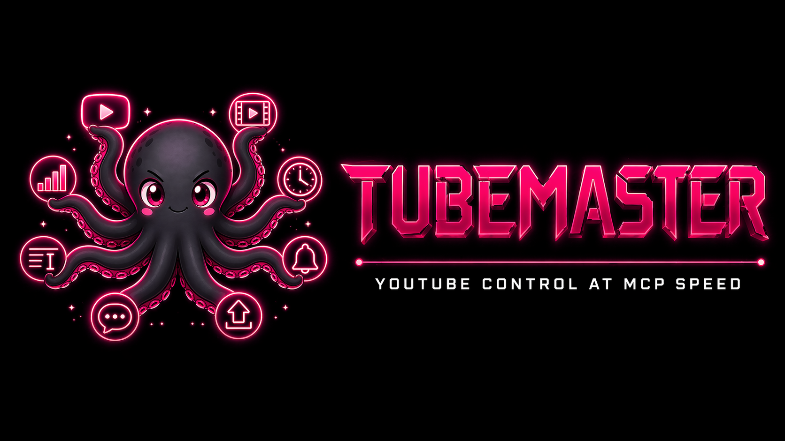

# TubeMaster — YouTube Channel Operations Manager



TubeMaster helps you **authenticate once and safely operate a YouTube channel end-to-end**: videos, metadata, transcripts, playlists, rules, and agent integrations via **Web UI, CLI, MCP, or API Route Handlers**.

<p>
  
  
</p>

## Start here (from zero to working app)

1. **Configure Google Cloud OAuth + YouTube API**
   - Follow: [docs/getting-started.md#1-google-cloud-console-setup](docs/getting-started.md#1-google-cloud-console-setup)
2. **Create `.env.local`** with required credentials
   - Follow: [docs/getting-started.md#2-local-environment-envlocal](docs/getting-started.md#2-local-environment-envlocal)
3. **Install and run locally**
   - `npm install`
   - `npm run dev`
4. **Authenticate and verify access** (CLI recommended first)
   - `npm run cli:video-metadata -- auth login`
   - `npm run cli:video-metadata -- auth whoami`

Full walkthrough: **[docs/getting-started.md](docs/getting-started.md)**

## Interfaces

| Interface | Entry point | Best for |
| --- | --- | --- |
| Web UI | `http://localhost:3000` | Visual channel operations: videos, playlists, and rules |
| CLI | `npm run cli:video-metadata -- <command>` | Local automation, scripts, manual ops |
| MCP Server (stdio) | `npm run mcp:video-metadata` | Agent/tool integrations |
| API Route Handlers | `/api/youtube/videos`, `/api/video-metadata/*` | App/backend integrations |

Detailed usage by interface: **[docs/interfaces.md](docs/interfaces.md)**

## Quick command examples

```bash
npm run dev
npm run test
npm run lint
```

### CLI examples

```bash
# Playlist operations
npm run cli:video-metadata -- playlist create --title "Roadtrip 2026" --description "Videos del viaje" --expectedChannelId <CHANNEL_ID> --privacyStatus unlisted
npm run cli:video-metadata -- playlist update --playlistId <PLAYLIST_ID> --expectedChannelId <CHANNEL_ID> --description "Nueva descripción"
npm run cli:video-metadata -- playlist add --playlistId <PLAYLIST_ID> --videoIds <VIDEO_ID_1>,<VIDEO_ID_2>

# Metadata operations
npm run cli:video-metadata -- transcript --videoId <VIDEO_ID>
npm run cli:video-metadata -- preview --videoId <VIDEO_ID> --editorialPrompt "Hacé un título claro"
npm run cli:video-metadata -- apply --videoId <VIDEO_ID> --finalTitle "Nuevo título" --description "Nueva descripción" --expectedChannelId <CHANNEL_ID> --dryRun
```

## Environment Variables

### Required

- `GOOGLE_CLIENT_ID`
- `GOOGLE_CLIENT_SECRET`
- `NEXTAUTH_SECRET`
- `NEXTAUTH_URL`

See full env setup + Google credentials mapping: **[docs/getting-started.md#2-local-environment-envlocal](docs/getting-started.md#2-local-environment-envlocal)**

### Optional

- `YOUTUBE_TRANSCRIPT_PROVIDER` (`youtube-captions` by default)
- `METADATA_GENERATOR_MODE` (`rule-based` by default, `raw-json` for strict output checks)
- `METADATA_GENERATOR_RAW_OUTPUT` (used only when mode is `raw-json`)
- `CLI_OAUTH_CALLBACK_PORT` (`8787` by default; if changed, update OAuth redirect URI accordingly)

## Contracts and Safety Guarantees

- **Stable JSON envelopes** across CLI/MCP/core with typed errors and non-zero exit status on failures.
- **Strict credential precedence**: explicit `credentialRef` → active local context (`data/auth-context.json`) → typed auth error.
- **Fail-closed write operations** (`apply`, `playlist_create`, `playlist_update`, `playlist_delete`) requiring `expectedChannelId`.
- **Safe playlist partial results** for add/remove operations (`attempted`/`added` + `failures[]`).
- **Transcript compatibility contract** with stable `status` and additive diagnostics.

Troubleshooting these guardrails and auth errors: **[docs/troubleshooting.md](docs/troubleshooting.md)**

## Documentation

- **Getting started (Google Cloud + local setup):** [docs/getting-started.md](docs/getting-started.md)
- **Web UI, CLI, MCP, API usage:** [docs/interfaces.md](docs/interfaces.md)
- **Common auth/API/env errors and fixes:** [docs/troubleshooting.md](docs/troubleshooting.md)

## Contributing

TubeMaster is open source under the [MIT License](LICENSE).

- Open an issue for bugs, contract changes, or feature requests.
- Open a PR with focused changes and clear reproduction/validation notes.
- Keep changes backward-compatible where possible, especially for CLI/MCP JSON contracts.

Read [CONTRIBUTING.md](CONTRIBUTING.md) for setup, validation, and PR expectations.

If you are integrating with agents, start the MCP server with:

```bash
npm run mcp:video-metadata
```
